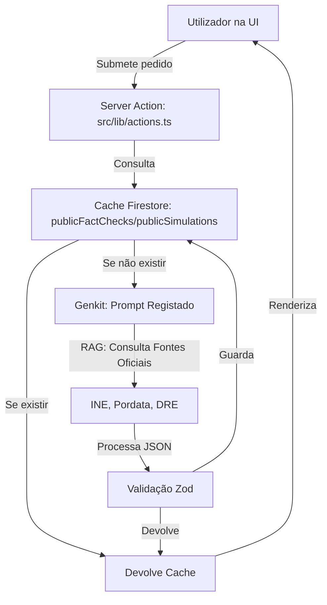

# 🏗️ Arquitetura Demokratia Portugal

Este documento serve como a fonte única de verdade para a estrutura técnica e operacional do projeto.

## 1. Stack Tecnológica
- **Framework:** [Next.js 15 (App Router)](https://nextjs.org/)
- **IA/GenAI:** [Genkit v1.x](https://firebase.google.com/docs/genkit) + Gemini 1.5 Flash
- **Backend/Base de Dados:** [Firebase (Firestore & Auth)](https://firebase.google.com/)
- **UI/Styling:** [Tailwind CSS](https://tailwindcss.com/), [Shadcn UI](https://ui.shadcn.com/), [Lucide React](https://lucide.dev/)
- **Gráficos:** [Recharts](https://recharts.org/)

## 2. Fluxo de Dados IA (RAG-Lite)

## 3. Mapa de Ficheiros Críticos (Pós-Limpeza)

### 📂 `src/lib/` (Lógica de Negócio)
- [`actions.ts`](../src/lib/actions.ts): **O Cérebro Único**. Contém todas as chamadas ao Genkit e lógica de simulação.
- [`api-client.ts`](../src/lib/api-client.ts): Integração com APIs financeiras externas.
- [`i18n.tsx`](../src/lib/i18n.tsx): Sistema de internacionalização (PT/EN).

### 📂 `src/firebase/` (Infraestrutura)
- [`index.ts`](../src/firebase/index.ts): Inicialização centralizada dos SDKs.
- [`non-blocking-updates.tsx`](../src/firebase/non-blocking-updates.tsx): Escrita otimizada no Firestore.

### 📂 `src/app/` (Rotas Principais)
- `/explorer`: Consulta de dados estatísticos brutos.
- `/simulations`: Simulador de políticas (inclui modo Comparação).
- `/scenarios`: Laboratório macroeconómico com sliders.
- `/map`: Atlas Regional interativo.

## 4. Padrões de Desenvolvimento
1.  **Single Source of Truth:** Lógica de servidor apenas em `src/lib/actions.ts`.
2.  **Mobile-First:** Prioridade absoluta à usabilidade em smartphones.
3.  **Tradução:** Uso obrigatório do `DICTIONARY` em `src/lib/i18n.tsx`.

---
*Atualizado após consolidação de ficheiros redundantes.*
