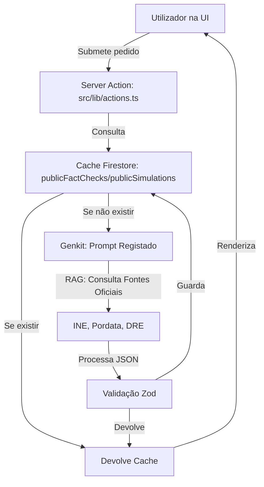

# 🏗️ Arquitetura Demokratia Portugal

Este documento serve como a fonte única de verdade para a estrutura técnica e operacional do projeto. Deve ser consultado antes de qualquer alteração de código para garantir consistência e evitar redundâncias.

## 1. Stack Tecnológica
- **Framework:** [Next.js 15 (App Router)](https://nextjs.org/)
- **IA/GenAI:** [Genkit v1.x](https://firebase.google.com/docs/genkit) + Gemini 1.5 Flash
- **Backend/Base de Dados:** [Firebase (Firestore & Auth)](https://firebase.google.com/)
- **UI/Styling:** [Tailwind CSS](https://tailwindcss.com/), [Shadcn UI](https://ui.shadcn.com/), [Lucide React](https://lucide.dev/)
- **Gráficos:** [Recharts](https://recharts.org/)

## 2. Fluxo de Dados IA (RAG-Lite)

## 3. Mapa de Ficheiros Críticos

### 📂 `docs/` (Configuração e Planeamento)
- [`backend.json`](./backend.json): Blueprint das entidades e caminhos do Firestore.
- [`ARCHITECTURE.md`](./ARCHITECTURE.md): Este ficheiro (Mapa Técnico).
- [`AI_COLLABORATION_GUIDELINES.md`](../AI_COLLABORATION_GUIDELINES.md): **REGRAS DE OURO** para colaboração com a IA.
- [`proposals.md`](./proposals.md): Roadmap de funcionalidades futuras.

### 📂 `src/lib/` (Lógica de Negócio)
- [`actions.ts`](../src/lib/actions.ts): O "Cérebro". Contém todas as Server Actions que invocam o Genkit.
- [`api-client.ts`](../src/lib/api-client.ts): Integração com APIs externas (Alpha Vantage, etc.).
- [`i18n.tsx`](../src/lib/i18n.tsx): Sistema de internacionalização (PT/EN). **Não usar strings fixas na UI.**
- [`system-data-sources.ts`](../src/lib/system-data-sources.ts): Catálogo de fontes oficiais monitorizadas.

### 📂 `src/firebase/` (Infraestrutura)
- [`index.ts`](../src/firebase/index.ts): Inicialização centralizada dos SDKs.
- [`non-blocking-updates.tsx`](../src/firebase/non-blocking-updates.tsx): Padrão de escrita no Firestore sem bloqueio da UI.
- [`use-collection.tsx`](../src/firebase/firestore/use-collection.tsx) & [`use-doc.tsx`](../src/firebase/firestore/use-doc.tsx): Hooks estáveis para subscrição em tempo real.

### 📂 `src/app/` (Rotas e Páginas)
- `/explorer`: Consulta de dados estatísticos brutos.
- `/simulations`: Simulador de políticas via IA.
- `/scenarios`: Laboratório económico com sliders.
- `/map`: Atlas Regional interativo (SVG).
- `/admin`: Painel de gestão de fontes e mensagens.

## 4. Padrões de Desenvolvimento

1.  **Mobile-First:** Todos os componentes em `src/components` devem ser testados para ecrãs pequenos.
2.  **Singleton IA:** A instância `ai` em `actions.ts` deve ser única para evitar falhas de registo no HMR.
3.  **Segurança:** Regras de acesso definidas em `firestore.rules` baseadas em `roles_admin`.
4.  **Tradução:** Qualquer nova funcionalidade deve incluir chaves no `DICTIONARY` em `src/lib/i18n.tsx`.

## 5. Estratégia de Resiliência de Dados
- **Primária:** Cache Firestore (evita custos de API e latência).
- **Secundária:** IA via Genkit (para dados dinâmicos ou não estruturados).
- **Terciária:** Fallback para Alpha Vantage/Yahoo Finance em cotações financeiras.

---
*Este ficheiro deve ser mantido atualizado pelo assistente IA em cada alteração estrutural significativa.*
