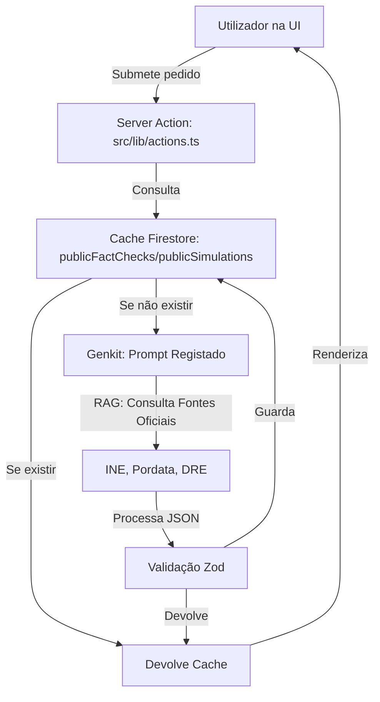

# 🏗️ Arquitetura Demokratia Portugal

Este documento serve como a fonte única de verdade para a estrutura técnica e operacional do projeto.

## 1. Stack Tecnológica
- **Framework:** [Next.js 15 (App Router)](https://nextjs.org/)
- **IA/GenAI:** [Genkit v1.x](https://firebase.google.com/docs/genkit) + Gemini 1.5 Flash
- **Backend/Base de Dados:** [Firebase (Firestore & Auth)](https://firebase.google.com/)
- **UI/Styling:** [Tailwind CSS](https://tailwindcss.com/), [Shadcn UI](https://ui.shadcn.com/), [Lucide React](https://lucide.dev/)
- **Gráficos:** [Recharts](https://recharts.org/)

## 2. Fluxo de Dados IA (RAG-Lite)

## 3. Mapa de Ficheiros Críticos

### 📂 `src/lib/` (Lógica de Negócio)
- [`actions.ts`](../src/lib/actions.ts): **O Cérebro Único**. Contém todas as chamadas ao Genkit e lógica de simulação.
- [`actions-schema.ts`](../src/lib/actions-schema.ts): Definições de tipos e esquemas Zod (partilhado entre Server e Client).
- [`server-actions.ts`](../src/lib/server-actions.ts): Ponte de compatibilidade para exportação de tipos e funções.
- [`api-client.ts`](../src/api-client.ts): Integração com APIs financeiras externas (Alpha Vantage).

### 📂 `src/firebase/` (Infraestrutura)
- [`index.ts`](../src/firebase/index.ts): Inicialização centralizada dos SDKs.
- [`non-blocking-updates.tsx`](../src/firebase/non-blocking-updates.tsx): Escrita otimizada no Firestore (não aguarda resposta).

### 📂 `src/app/` (Rotas Principais)
- `/explorer`: Consulta de dados estatísticos brutos e consulta inteligente.
- `/simulations`: Simulador de impacto de políticas (inclui histórico e partilha).
- `/scenarios`: Laboratório macroeconómico com sliders interativos.
- `/map`: Atlas Regional interativo (Portugal Continental e Ilhas).

### ⚠️ AVISO DE SEGURANÇA (BACKUP)
O ficheiro `src/app/(app)/map/page copy.tsx` é um **backup crítico** do código do mapa. **NÃO ALTERAR NEM REMOVER.** Serve como ponto de restauração em caso de corrupção do ficheiro principal do mapa.

## 4. Roteiro de Desenvolvimento (Roadmap)
- [ ] **Tarefa A: Refinamento de Prompts Oficiais**
    *   **Objetivo**: Ajustar as instruções do sistema em `src/lib/actions.ts` para obrigar a IA a citar fontes portuguesas específicas (INE, Pordata, DRE) com mais rigor.
    *   **Impacto**: Maior credibilidade e redução de alucinações legais/estatísticas.
- [ ] **Tarefa B: Comparador de Políticas**
    *   **Objetivo**: Implementar a vista lado-a-lado na página `/simulations`.
- [ ] **Tarefa C: Resiliência de Cotações**
    *   **Objetivo**: Integrar fallback para Yahoo Finance no componente `StockMarketTicker`.

## 5. Padrões de Desenvolvimento
1.  **Single Source of Truth:** Lógica de servidor apenas em `src/lib/actions.ts`.
2.  **Mobile-First:** Prioridade absoluta à usabilidade em smartphones.
3.  **Segurança de Tipos:** Importar sempre tipos de `@/lib/server-actions` para componentes UI.

---
*Documento atualizado para refletir a consolidação da Tarefa 1 e estabilização de IA.*
